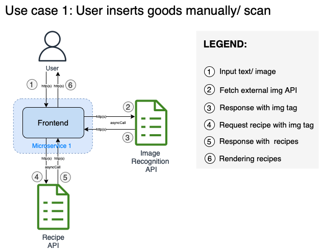

## Architecture Solution Diagram
The architecture is based on microservices pattern to isolate each service from each other and develop them independently.

Below architecture diagrams describe multiple use cases:
- UC 1: User inserts goods manually
- UC 2: User upload an image of goods

### Use case 1: User inserts goods manually

### Use case 2: User upload an image of goods

